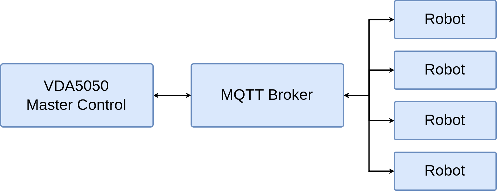
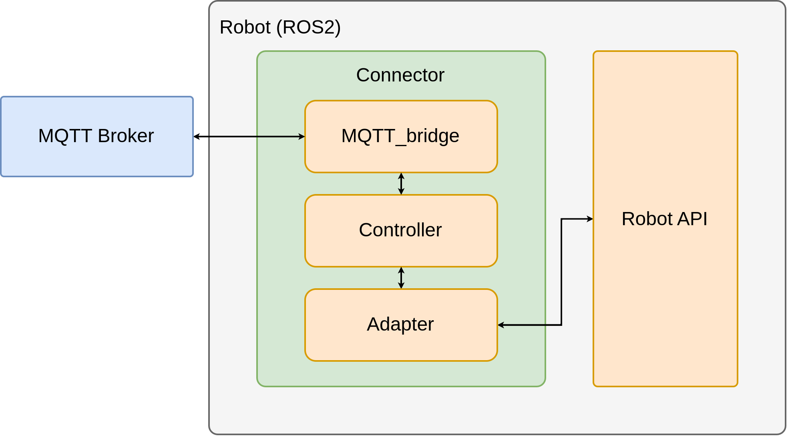
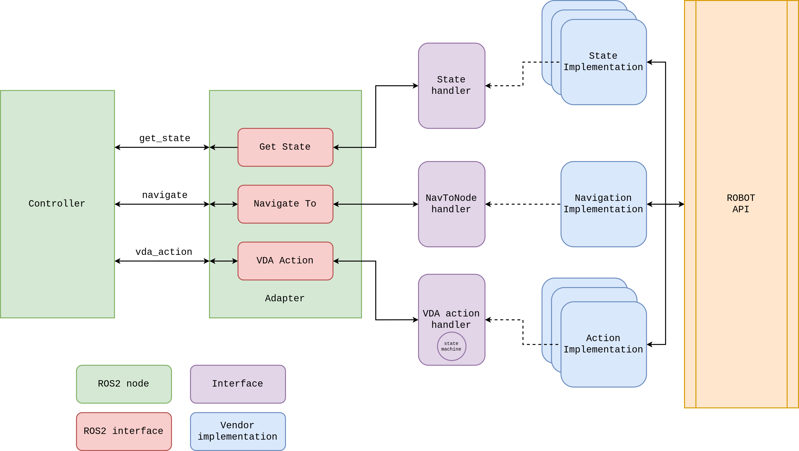

# VDA5050 Connector

A ROS2 package which implements a connector for [VDA5050](https://github.com/VDA5050/VDA5050/blob/main/VDA5050_EN.md), a standardized interface for communication between fleets of AGVs/AMRs and a central Master Control.

## Overview

The package names itself *Connector*, since it can be thought as a bridge between a VDA5050 Master Control (MC) and the ROS2 robot API.



The connector is composed of three main parts (ROS2 nodes):

- **MQTT_bridge**: Communicates the VDA5050 <> ROS2 topics, translating [VDA5050 messages](https://github.com/VDA5050/VDA5050/tree/main/json_schemas) into ROS2 [vda5050_msgs](https://github.com/ipa320/vda5050_msgs/tree/ros2-vda5050-v2) and vice versa.
- **Controller**: Processes the VDA5050 robot execution as per standard specification. It validates, executes, or rejects orders and instant actions, as well as assembles feedback information to the MC.
- **Adapter**: Provides the interaction between the controller and the Robot API. The adapter is the one who knows how to send a navigation goal request, execute an action or retrieve specific information robot such as battery or odometry.



The way the adapter knows how to execute the different operations requested by the controller is using ROS2 plugins (components). The current project provides three plugin template interfaces, called handlers, which cover the main communication paths:

- **State handler**: Designed for updating robot specific information on the VDA5050 [order_state](https://github.com/ipa320/vda5050_msgs/blob/ros2-vda5050-v2/vda5050_msgs/msg/OrderState.msg).
- **NavTONode handler**: Designed for sending goals to the robot navigation stack.
- **VDA Action handler**: Designed for handling requests to execute specific actions (localize, lift a load, etc).



## How to use it

The package is also a library package; it exports the headers and binary files to create and assemble a specific adapter. To create your own adapter package, add this package as a dependency and define the different plugin handlers for your robot. You can also customize the adapter core functionalities if desired.

To do this this, you can check the [vda5050_examples](https://github.com/inorbit-ai/vda5050_adapter_examples) repository, where you will find examples of adapter packages, for python and C++, as well as docker scripts to quickly start testing them.

### Dependencies

- ROS2 - ament_cmake: The package is based on ROS2, and uses `ament_cmake`.
- [vda5050_msgs](https://github.com/ipa320/vda5050_msgs/tree/ros2-vda5050-v2): ROS2 messages for the VDA5050 standard (version 2.0).
- [pluginlib](http://wiki.ros.org/pluginlib): The adapter uses plugins to load the different handlers.
- [python3-paho-mqtt](https://pypi.org/project/paho-mqtt/): The `mqtt_bridge` uses the `paho-mqtt` library as the mqtt client.

### Compilation

Start a docker container with the required packages mounted on `dev_ws`:

```bash
# Go to the repository root folder and execute
docker run -ti --rm \
    --workdir /dev_ws/ \
    -v ./vda5050_msgs:/dev_ws/src/vda5050_msgs \
    -v ./vda5050_serializer:/dev_ws/src/vda5050_serializer \
    -v ./vda5050_connector:/dev_ws/src/vda5050_connector \
    osrf/ros:humble-desktop-full
```

Now build the package:

```bash
apt update && apt install ros-humble-ament* -y
cd /dev_ws/
colcon build --symlink-install
```

### Testing

The package provides several lint test (`ament_pep257` and `ament_flake8` for Python, `ament_clang_format` for C++ and `ament_copyright`), as well as specific unit tests to check the correct functionality of the different modules. To run the tests, execute:

```sh
cd /dev_ws/
rosdep install --from-paths src -y --ignore-src
colcon test --packages-select vda5050_connector && colcon test-result --verbose
```

## Contributing

Please see the [CONTRIBUTING](CONTRIBUTING.md) document.

## License

[](LICENSE)
